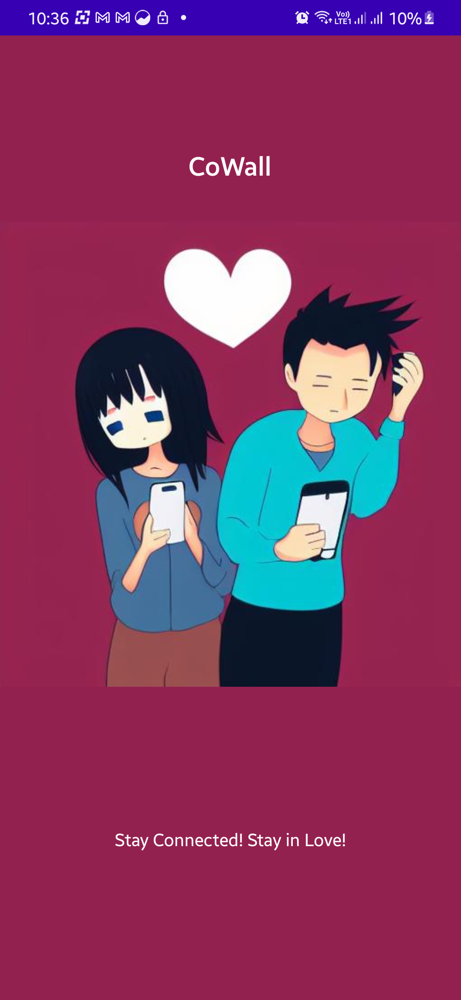
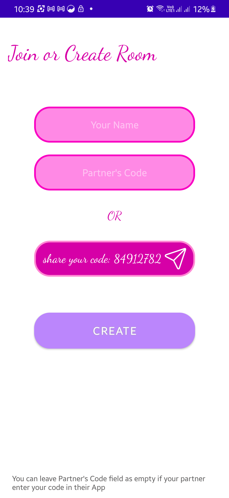
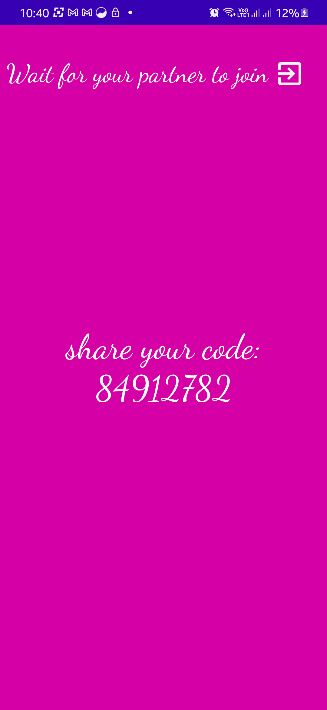
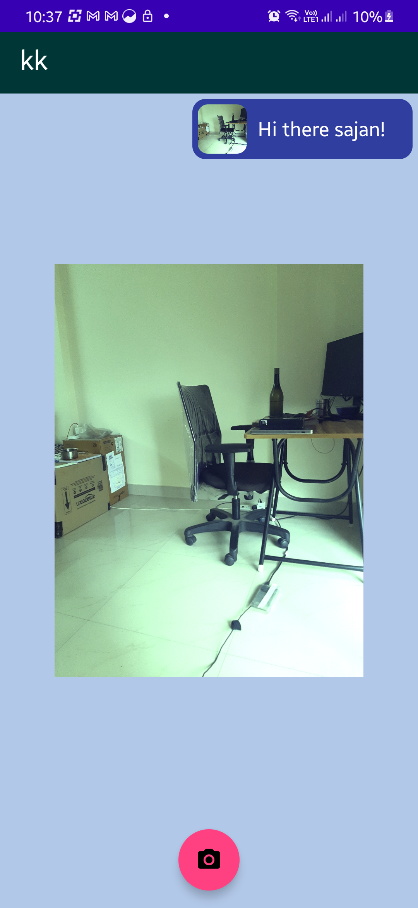
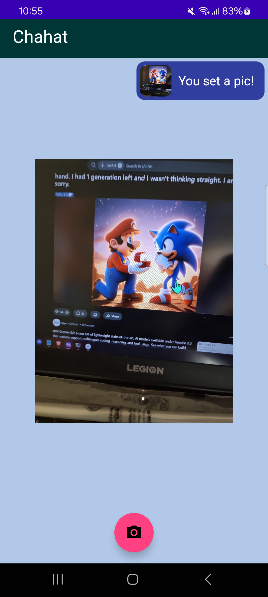
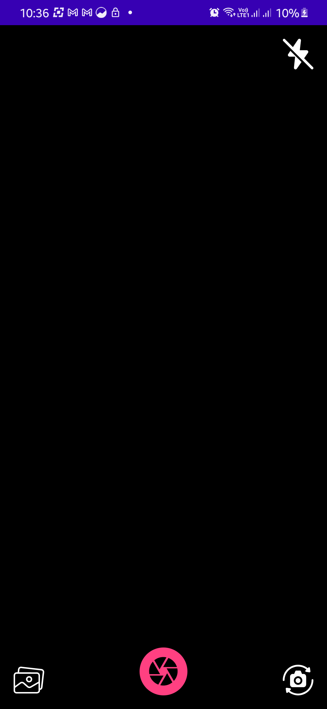

# CoWall

An Android application that lets two users set each other's lock screen wallpaper in real-time. Users capture or select images, apply GPU-accelerated filters, and send them — the recipient's lock screen updates automatically in the background without requiring phone interaction.

---

## Features

- **Real-time wallpaper sync** — Images sent by a partner are downloaded and applied to the lock screen via a foreground background service
- **Camera capture** — CameraX-powered front/back camera with flash mode toggle and gallery fallback
- **Image filters** — GPU-accelerated filter previews via GPUImage; tap to preview, long-press to revert
- **Chat room** — Scrollable history of all sent/received images; long-press to enlarge any image
- **Room-based pairing** — Create a room with an 8-digit code, share it with your partner to pair devices
- **Persistent session** — SharedPreferences stores room and user identity across app restarts

---

## Architecture

MVVM with Repository pattern and Koin dependency injection.

```
SplashScreenActivity
    └── checks SharedPreferences for existing room
         ├── CreateOrJoinRoom     (first launch)
         └── MainActivity → ChatRoomActivity   (returning user)
                                ├── CameraActivity
                                │     └── EditImageActivity
                                └── SendCapturedImageActivity

RunningService  (foreground service)
    └── FireBaseConnector.lookForUpdates()
          └── downloads new images → sets lock screen wallpaper
```

**Layers:**

| Layer | Files |
|---|---|
| Activities | `SplashScreenActivity`, `CreateOrJoinRoom`, `MainActivity`, `ChatRoomActivity`, `CameraActivity`, `EditImageActivity`, `SendCapturedImageActivity` |
| ViewModels | `ChatRoomViewModel`, `EditImageViewModel` |
| Repositories | `DatabaseRepository` / `DatabasesRepositoryImpl`, `EditImageRepository` / `EditImageRepositoryImpl` |
| Firebase bridge | `FireBaseConnector` |
| DI modules | `FirebaseModule`, `RepositoryModule`, `ViewModelModule` |
| Background | `RunningService` |

---

## Tech Stack

| Category | Library / Tool | Version |
|---|---|---|
| Language | Kotlin | 1.6.10 |
| Build | Android Gradle Plugin | 7.2.2 |
| Min SDK | — | 21 |
| Target SDK | — | 33 |
| Camera | CameraX | 1.2.0-alpha02 |
| Image filters | GPUImage | 2.1.0 |
| Firebase | BOM | 28.3.1 |
| — | Realtime Database | (BOM) |
| — | Cloud Storage | (BOM) |
| — | Authentication | (BOM) |
| Dependency injection | Koin | 2.0.1 |
| Async | Kotlin Coroutines | — |
| JSON | Gson | — |
| UI | Material Components, ConstraintLayout, RoundedImageView, SDP/SSP | — |

---

## Firebase Data Structure

```
chatRooms/
  {roomId}/
    participants/
      {userId}: true

userName/
  {userId}: "displayName"

roomChat/
  {roomId}/
    {messageId}: { userUniqueId, uri }
```

Images are stored in Firebase Storage at `file/{roomId}/{imageName}.jpg`.

---

## Permissions Required

```xml
android.permission.CAMERA
android.permission.SET_WALLPAPER
android.permission.FOREGROUND_SERVICE
android.permission.POST_NOTIFICATIONS
android.permission.READ_MEDIA_IMAGES
android.permission.READ_MEDIA_VIDEO
android.permission.READ_EXTERNAL_STORAGE
android.permission.WRITE_EXTERNAL_STORAGE   <!-- maxSdkVersion 28 -->
```

---

## Setup

### Prerequisites

- Android Studio Dolphin or later
- JDK 11+
- A Firebase project with Realtime Database and Cloud Storage enabled

### Steps

1. Clone the repository:
   ```bash
   git clone https://github.com/your-username/CoWall.git
   ```

2. Open in Android Studio.

3. Add your Firebase configuration file:
   ```
   app/google-services.json
   ```

4. In the Firebase console:
   - Enable **Realtime Database** (start in test mode or configure rules)
   - Enable **Cloud Storage**
   - Enable **Authentication** (anonymous or your preferred provider)

5. Build and run on a physical device (API 21+). CameraX and `SET_WALLPAPER` require a real device for full functionality.

---

## Screenshots

<div align="center">
  <table>
    <tr>
      <td align="center">
        <br>
        <sub>Splash Screen</sub>
      </td>
      <td align="center">
        <br>
        <sub>Create or Join Room</sub>
      </td>
      <td align="center">
        <br>
        <sub>Waiting Screen</sub>
      </td>
      <td align="center">
        <br>
        <sub>Home Screen</sub>
      </td>
    </tr>
    <tr>
      <td align="center">
        <br>
        <sub>Home Screen</sub>
      </td>
      <td align="center">
        <br>
        <sub>Camera</sub>
      </td>
      <td align="center">
        <br>
        <sub>Image Filters</sub>
      </td>
      <td align="center">
        <br>
        <sub>Lock Screen Result</sub>
      </td>
    </tr>
  </table>
</div>

---

## License

MIT
